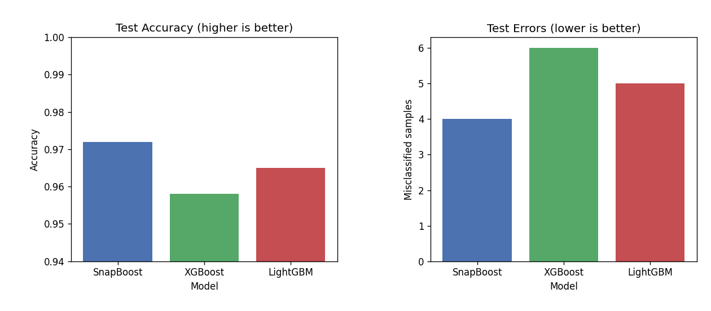
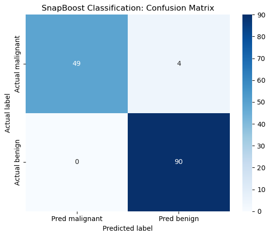
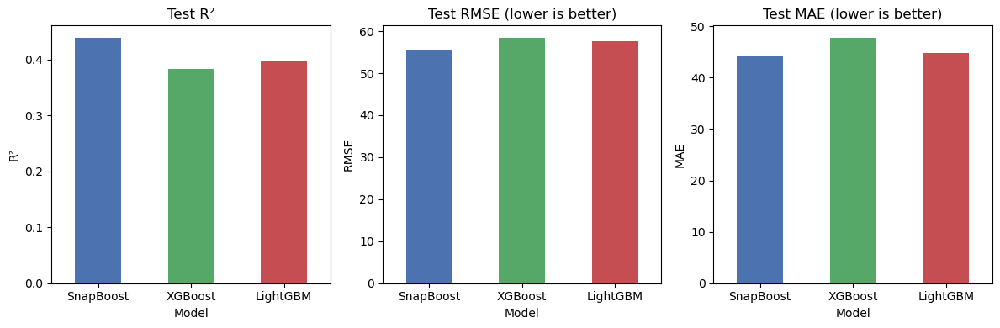
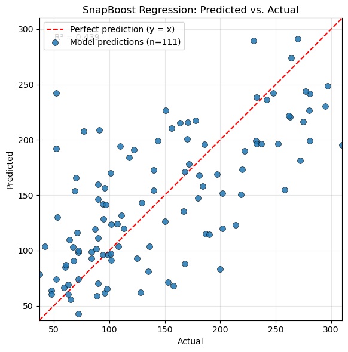
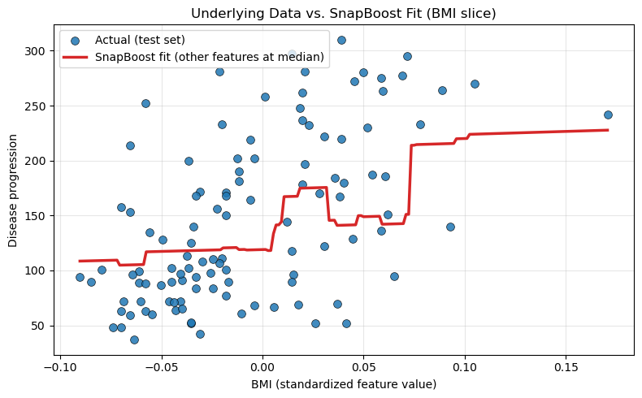
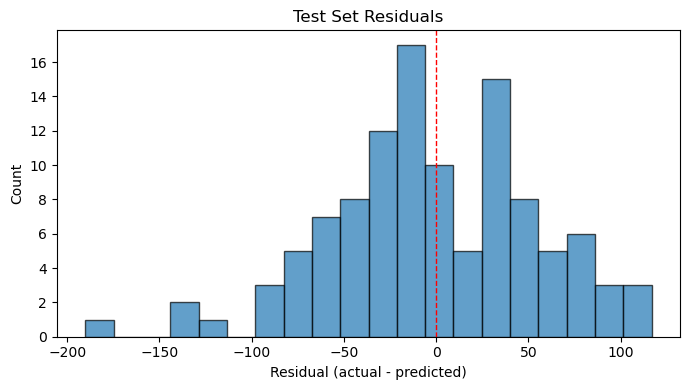
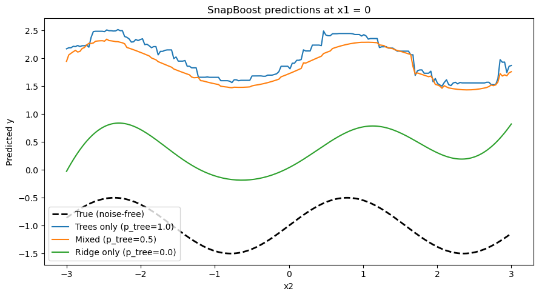

# SnapBoost

[](https://pypi.org/project/snapboost/)
[](https://opensource.org/licenses/MIT)
[](https://scikit-learn.org/)

**SnapBoost** is an instance of a **Heterogeneous Newton Boosting Machine (HNBM)** — a generalized gradient boosting framework that supports the use of various types of learners aside from trees. Snapboost is an HNBM that mixes decision trees and kernel ridge regressors instead of trees alone. The core [HNBM](https://github.com/qiancapital/hnbm) framework is provided by the `hnbm` package; SnapBoost is a concrete implementation built on top of it.

Unlike XGBoost and LightGBM, which rely exclusively on decision trees as base learners, SnapBoost stochastically selects from a heterogeneous pool of learners at each boosting iteration. This lets the model capture both local, axis-aligned structure (trees) and smooth, global patterns (RBF kernel ridge).

This package is a Python/scikit-learn reimplementation inspired by [SnapBoost: A Heterogeneous Boosting Machine](https://arxiv.org/abs/2006.09745) (Parnell et al., NeurIPS 2020). See [REFERENCES.md](REFERENCES.md) for papers, related work, and citation details.

## New in 1.2

SnapBoost 1.2 inherits native multiclass classification from HNBM 1.2:
softmax Newton boosting with one scalar learner per class each round.
Binary logistic classification is unchanged. Multiclass
`decision_function` and `predict_proba` have shape `(n_samples, n_classes)`,
and fitted classifiers expose `n_classes_`. Requires HNBM 1.2.0 or newer.

```python
from sklearn.datasets import load_iris
from snapboost import SnapBoostClassifier

X, y = load_iris(return_X_y=True)
model = SnapBoostClassifier(num_iterations=100, random_state=42)
model.fit(X, y)
print(model.n_classes_, model.predict_proba(X).shape)  # 3, (n_samples, 3)
```

## New in 1.1

SnapBoost 1.1 adds `gamma="scale"`, an independent `alpha_linear` ridge
penalty for the optional linear family, staged prediction, and
`permutation_importance`. `eval_metric` receives original labels, and
`eval_sample_weight` is accepted for validation loss and early stopping.
Requires HNBM 1.1 or newer.

```python
staged = list(model.staged_predict(X))
importance = model.permutation_importance(X, y, n_repeats=5, random_state=42)
```

## New in 1.0

SnapBoost 1.0 freezes `SnapBoostClassifier` / `SnapBoostRegressor`, requires
HNBM 1.0 or newer, and delays SnapBoost-specific parameter validation until
`fit`. Constructing `SnapBoost(mode=...)` or `SnapBoost_KernelRidge` is
deprecated.

---

## Table of Contents

- [New in 1.2](#new-in-12)
- [Documentation](#documentation)
- [Features](#features)
- [Heterogeneous Gradient Boosting](#heterogeneous-gradient-boosting)
- [Installation](#installation)
- [Quick Start](#quick-start)
- [Examples & Results](#examples--results)
- [API Reference](#api-reference)
  - [SnapBoostClassifier / SnapBoostRegressor](#snapboostclassifier--snapboostregressor)
  - [SnapBoost](#snapboost)
  - [HNBM](#hnbm)
- [Parameters](#parameters)
- [Docker](#docker)
- [Development](#development)
- [References & Citation](#references--citation)
- [License](#license)

---

## Documentation

The SnapBoost API documentation lives in [`docs/`](docs/). To build locally:

```bash
pip install -r docs/requirements.txt
cd docs && make html
# open _build/html/index.html
```

Documentation is published at https://snapboost.qiancapital.com/ (GitHub Pages). The live docs on `/` track `master` (**latest**). Release snapshots are under `/vX.Y.Z/` (for example `/v1.2.0/`) and are rebuilt from `docs/versions.json` on each `master` deploy. Use the version dropdown under **SnapBoost** in the sidebar to switch between them.

---

## Features

| Tag | Description |
|-----|-------------|
| `gradient-boosting` | Second-order Newton boosting with gradient and Hessian weighting |
| `heterogeneous-learners` | Mixes decision trees and kernel ridge regressors in one ensemble |
| `classification` | Binary logistic loss or multiclass softmax |
| `regression` | Continuous targets with mean squared error loss |
| `scikit-learn` | Implements the scikit-learn estimator API (`fit`, `predict`, `score`, …) |
| `randomized-ensemble` | Stochastic base-learner selection per iteration |

---

## Heterogeneous Gradient Boosting

SnapBoost builds an additive predictor from heterogeneous learners:

$$
F_M(x)=F_0+\sum_{m=1}^{M}\eta_m f_m(x),
$$

where $F_0$ is a constant initial prediction, $f_m$ is a decision tree,
random-Fourier-feature (RFF) ridge model, or optional linear ridge model, and
$\eta_m$ is the learning rate (or a per-round step selected by line search).

At round $m$, let $F_{m-1}(x_i)$ be the current raw prediction and let
$\ell(y_i,F)$ be the objective. SnapBoost computes

$$
g_i=\left.\frac{\partial\ell(y_i,F)}{\partial F}\right|_{F=F_{m-1}(x_i)},
\qquad
h_i=\left.\frac{\partial^2\ell(y_i,F)}{\partial F^2}\right|_{F=F_{m-1}(x_i)}.
$$

A second-order Taylor expansion turns the next functional step into weighted
least squares. The selected learner is therefore fit to the Newton working
response

$$
r_i=-\frac{g_i}{h_i},
\qquad
f_m\approx\arg\min_{f\in\mathcal H_{k_m}}
\sum_{i=1}^{n} w_i h_i\bigl(r_i-f(x_i)\bigr)^2,
$$

where $w_i$ is the observation weight. With the default random strategy, the
learner family $k_m$ is sampled from the configured pool: tree depths share
probability `p_tree`, the optional linear learner has probability `p_linear`,
and RFF kernel candidates share the remainder. The update is

$$
F_m(x)=F_{m-1}(x)+\eta_m f_m(x).
$$

For squared-error regression, $g_i=2(F-y_i)$ and $h_i=2$, so $r_i=y_i-F$:
ordinary residual boosting is recovered. For binary classification SnapBoost
encodes labels as $y_i\in\{-1,+1\}$ and uses logistic loss,

$$
\ell(y,F)=\log(1+e^{-yF}),\quad
g=-y\,\sigma(-yF),\quad
h=\sigma(yF)\sigma(-yF),
$$

with class probability $P(y=+1\mid x)=\sigma(F_M(x))$. Multiclass targets
use a $K$-vector score $F(x)\in\mathbb{R}^K$ with

$$
p=\mathrm{softmax}(F),\quad
\ell=-\log p_{y},\quad
g_k=p_k-\mathbf{1}_{\{k=y\}},\quad
h_k=p_k(1-p_k),
$$

$$
r_k=-\frac{g_k}{h_k}
=\frac{\mathbf{1}_{\{k=y\}}-p_k}{p_k(1-p_k)},
\qquad
F_{0,k}=\log\widehat p_k.
$$

Each round fits $K$ scalar learners from the same family and
$P(y=k\mid x)=\mathrm{softmax}(F_M(x))_k$. See [MATH.md](MATH.md) for the
full Hessian, the diagonal approximation, and the stable log-sum-exp form.

The smooth branch approximates a stationary kernel with random features. For
the default RBF kernel $k(x,x')=\exp(-\gamma\lVert x-x'\rVert_2^2)$,

$$
\phi_j(x)=\sqrt{\frac{2}{D}}\cos(\omega_j^\top x+b_j),
\quad \omega_j\sim\mathcal N(0,2\gamma I),
\quad b_j\sim\mathrm{Uniform}(0,2\pi),
$$

and weighted ridge regression solves

$$
\hat\beta=\arg\min_\beta
\sum_i w_i h_i\bigl(r_i-\phi(x_i)^\top\beta\bigr)^2
+\alpha\lVert\beta\rVert_2^2.
$$

Thus, trees model local axis-aligned interactions while RFF ridge learners add
smooth global corrections. XGBoost applies a related second-order expansion
but restricts every round to a regularized tree and optimizes leaf weights and
split gains analytically; SnapBoost instead projects the Newton step onto a
randomly selected (or greedily selected) heterogeneous hypothesis class.

See [MATH.md](MATH.md) for the full derivation, initialization and objective
formulas, RFF and tree subproblems, optional training behavior, and a detailed
comparison with gradient boosting, Newton tree boosting, and XGBoost.

---

## Installation

**From PyPI** (recommended):

```bash
pip install snapboost
```

**From source**:

```bash
git clone https://github.com/qiancapital/snapboost.git
cd snapboost
pip install .
```

**Requirements**: Python ≥ 3.9, NumPy, scikit-learn, tqdm, [`hnbm`](https://pypi.org/project/hnbm/) ≥ 1.2.0.

---

## Quick Start

### Classification

```python
from sklearn.datasets import load_breast_cancer
from sklearn.model_selection import train_test_split
from snapboost import SnapBoostClassifier

X, y = load_breast_cancer(return_X_y=True)
X_train, X_test, y_train, y_test = train_test_split(X, y, random_state=42)

model = SnapBoostClassifier(
    num_iterations=100,
    learning_rate=0.1,
    random_state=42,
)
model.fit(X_train, y_train)

print("Accuracy:", model.score(X_test, y_test))
print("Probabilities shape:", model.predict_proba(X_test).shape)  # (n_samples, 2)
model.evaluate(X_test, y_test)  # prints log loss
```

Multiclass labels work the same way. `predict_proba` and `decision_function`
then have one column per class:

```python
from sklearn.datasets import load_iris

X, y = load_iris(return_X_y=True)
model = SnapBoostClassifier(num_iterations=100, random_state=42)
model.fit(X, y)
print(model.n_classes_, model.predict_proba(X).shape)  # 3, (n_samples, 3)
```

### Regression

```python
from sklearn.datasets import load_diabetes
from sklearn.model_selection import train_test_split
from snapboost import SnapBoostRegressor

X, y = load_diabetes(return_X_y=True)
X_train, X_test, y_train, y_test = train_test_split(X, y, random_state=42)

model = SnapBoostRegressor(
    num_iterations=100,
    learning_rate=0.1,
    random_state=42,
)
model.fit(X_train, y_train)

print("R²:", model.score(X_test, y_test))
model.evaluate(X_test, y_test)  # prints RMSE
```

### Adaptive training

An opt-in adaptive training path is available, while the original random HNBM
algorithm remains the default:

```python
model = SnapBoostRegressor(
    num_iterations=500,
    learning_rate=0.05,
    selection_strategy="greedy",  # fit the best learner family each round
    line_search=True,              # tune each learner's contribution
    subsample=0.8,                 # stochastic row sampling
    max_features=0.8,              # tree feature sampling
    early_stopping_rounds=30,
    random_state=42,
)
model.fit(
    X_train,
    y_train,
    sample_weight=train_weights,
    eval_set=(X_validation, y_validation),
)

print(model.best_iteration_)
print(model.history_["validation_loss"])
```

The RFF branch now standardizes its inputs by default and receives a fresh,
reproducible random basis each boosting round. Set `scale_features=False` only
when inputs have already been placed on comparable scales.

### Optional additive extensions

The classic learner pool remains the default. Additional families and kernels
are enabled explicitly:

```python
model = SnapBoostRegressor(
    p_tree=0.7,
    p_linear=0.1,
    kernel_gammas=(0.05, 0.5, 5.0),
    kernel_types=("rbf", "laplacian"),
    objective="pseudo_huber",
    objective_parameter=2.0,
    random_state=42,
)
model.fit(X_train, y_train, candidate_n_jobs=4)
```

Missing and categorical inputs can be handled outside the estimator with a
normal scikit-learn pipeline, keeping SnapBoost's model format unchanged:

```python
from sklearn.pipeline import Pipeline
from snapboost import make_tabular_preprocessor

pipeline = Pipeline([
    ("prepare", make_tabular_preprocessor(categorical_features=(1, 4))),
    ("model", SnapBoostRegressor(random_state=42)),
])
```

---

## Examples & Results

Interactive Jupyter notebooks in [`static/`](static/) walk through classification, regression, and hyperparameter exploration. Each notebook trains SnapBoost and compares it against **XGBoost** and **LightGBM** on the same splits.

| Notebook | Dataset | SnapBoost | XGBoost | LightGBM |
|----------|---------|-----------|---------|----------|
| [Classification.ipynb](static/Classification.ipynb) | [Breast Cancer Wisconsin](https://scikit-learn.org/stable/modules/generated/sklearn.datasets.load_breast_cancer.html) | 97.2% accuracy | 95.8% | 96.5% |
| [Regression.ipynb](static/Regression.ipynb) | [Diabetes](https://scikit-learn.org/stable/modules/generated/sklearn.datasets.load_diabetes.html) | R² 0.44, RMSE 55.7 | R² 0.38, RMSE 58.4 | R² 0.40, RMSE 57.7 |
| [Parameter_Exploration.ipynb](static/Parameter_Exploration.ipynb) | Synthetic (piecewise + smooth) | R² 0.986, RMSE 0.170 | R² 0.986, RMSE 0.174 | R² 0.987, RMSE 0.167 |

Run the notebooks locally:

```bash
pip install ".[examples]"
jupyter notebook static/
```

### Classification

On the Breast Cancer dataset (250 boosting rounds), SnapBoost achieves the highest test accuracy and fewest misclassifications among the three boosters:



Confusion matrix for SnapBoost on the held-out test set:



### Regression

On the Diabetes dataset (100 boosting rounds), SnapBoost improves R² and RMSE over tree-only baselines:



Predicted vs. actual disease progression on the test set:



SnapBoost fitted curve along BMI (other features held at training medians):



Residual distribution:



### Parameter exploration

On a synthetic dataset mixing piecewise-linear and sinusoidal structure, the notebook sweeps `p_tree`, tree depth ranges, and kernel ridge parameters. A mixed ensemble (`p_tree=0.8`) outperforms trees-only (`p_tree=1.0`, RMSE 0.174) and ridge-only (`p_tree=0.0`, RMSE 0.366):



See [Parameter_Exploration.ipynb](static/Parameter_Exploration.ipynb) for the full sweeps and baseline comparison tables.

---

## API Reference

### SnapBoostClassifier / SnapBoostRegressor

The recommended entry points (similar to `XGBClassifier` / `XGBRegressor`). A concrete HNBM that builds an ensemble from:

- **Decision trees**, one candidate per depth in `[min_max_depth, max_max_depth]`
- **RFF ridge regressors** for smooth global fits, one candidate per `(kernel, gamma)` pair
- **An optional linear ridge learner**, included only when `p_linear > 0`

Each round draws one family from this pool. The tree families share `p_tree`
evenly, the kernel families share the remaining `1 - p_tree - p_linear` evenly,
and the linear learner takes `p_linear`. With the defaults (`p_tree=0.9`,
`p_linear=0.0`, three depths, one kernel) each tree depth is drawn with
probability `0.3` and the RFF learner with probability `0.1`.

```python
from snapboost import SnapBoostClassifier, SnapBoostRegressor

clf = SnapBoostClassifier(
    num_iterations=100,
    learning_rate=0.1,
    p_tree=0.8,
    min_max_depth=4,
    max_max_depth=8,
    alpha=1.0,
    gamma=1.0,
    random_state=42,
    verbose=True,
)
clf.fit(X, y)

reg = SnapBoostRegressor(num_iterations=100, random_state=42)
reg.fit(X, y)
```

**Methods**

| Method | Classifier | Regressor | Description |
|--------|------------|-----------|-------------|
| `fit(X, y, sample_weight=None, eval_set=None, *, eval_sample_weight=None)` | ✓ | ✓ | Train, optionally with weights, validation data, and validation weights |
| `predict(X)` | ✓ | ✓ | Original class labels or continuous values |
| `predict_proba(X)` | ✓ | | Class probabilities, shape `(n_samples, n_classes)` |
| `decision_function(X)` | ✓ | | Raw logits: `(n_samples,)` binary, `(n_samples, n_classes)` multiclass |
| `staged_predict(X)` | ✓ | ✓ | Predictions after each boosting round |
| `permutation_importance(X, y)` | ✓ | ✓ | Permutation importance of original features |
| `score(X, y)` | ✓ | ✓ | Accuracy or R² |
| `evaluate(X, y)` | ✓ | ✓ | Prints and returns log loss or RMSE |

### SnapBoost

Legacy class that accepts a `mode` parameter (`"classification"` or `"regression"`). Prefer `SnapBoostClassifier` or `SnapBoostRegressor` for new code.

```python
from snapboost import SnapBoost

model = SnapBoost(
    num_iterations=100,
    learning_rate=0.1,
    p_tree=0.8,
    min_max_depth=4,
    max_max_depth=8,
    alpha=1.0,
    gamma=1.0,
    mode="classification",  # or "regression"
    random_state=42,
    verbose=True,
)
model.fit(X, y)
```

### Exact kernel ridge variant

For smaller datasets where an exact RBF kernel is preferable to random Fourier
features, task-specific exact-kernel estimators are also available:

```python
from snapboost import (
    SnapBoostKernelRidgeClassifier,
    SnapBoostKernelRidgeRegressor,
)

clf = SnapBoostKernelRidgeClassifier(random_state=42)
reg = SnapBoostKernelRidgeRegressor(random_state=42)
```

These estimators keep a frozen constructor surface and so do not expose greedy
selection, line search, subsampling, or early stopping. They do inherit binary
and multiclass classification from HNBM. Exact kernel ridge has substantially
higher memory and runtime costs than the default RFF learner. The old
`SnapBoost_KernelRidge` name remains available for backward compatibility, but
new code should use the task-specific classes.

### HNBM

The abstract base class for building custom heterogeneous ensembles. Provided by the [`hnbm`](https://pypi.org/project/hnbm/) package — subclass or configure `base_learners_` and `probabilities_` before calling `fit`:

```python
from sklearn.tree import DecisionTreeRegressor
from hnbm import HNBMClassifier, HNBMRegressor

class MyClassifier(HNBMClassifier):
    def __init__(self, **kwargs):
        super().__init__(**kwargs)
        self.base_learners_ = [DecisionTreeRegressor(max_depth=5)]
        self.probabilities_ = [1.0]
```

---

## Parameters

### Shared (`HNBM` / `SnapBoostClassifier` / `SnapBoostRegressor`)

| Parameter | Type | Default | Description |
|-----------|------|---------|-------------|
| `num_iterations` | `int` | `100` | Number of boosting rounds |
| `learning_rate` | `float` | `0.1` | Shrinkage applied to each learner's contribution |
| `random_state` | non-negative `int` or `None` | `None` | Seed for learner selection and independently derived base-learner seeds |
| `verbose` | `bool` | `False` | Show a tqdm progress bar during training |
| `selection_strategy` | `{"random", "greedy"}` | `"random"` | Sample a learner or choose the lowest-loss candidate each round |
| `line_search` | `bool` | `False` | Select a separate contribution weight for every learner |
| `subsample` | `float` | `1.0` | Fraction of rows used to fit each base learner |
| `early_stopping_rounds` | positive `int` or `None` | `None` | Validation patience before restoring the best ensemble |
| `min_delta` | `float` | `0.0` | Minimum validation-loss improvement |
| `objective` | `str` | `"auto"` | Loss to optimize. Classifiers accept `"auto"` and `"log_loss"`; regressors also accept `"squared_error"`, `"pseudo_huber"`, and `"quantile"` |
| `objective_parameter` | `float` or `None` | `None` | Pseudo-Huber delta (default `1.0`) or quantile level (default `0.5`); ignored otherwise |

Classifiers select logistic loss for binary targets and softmax for multiclass
targets under both `objective="auto"` and `objective="log_loss"`.

> **Choosing the Pseudo-Huber delta.** The Newton working response for
> pseudo-Huber grows like `residual³ / delta²`, so the default `delta=1.0`
> diverges on targets that are not roughly unit-scale. Standardize `y`, or set
> `objective_parameter` to about the residual scale. This is the same
> consideration as `huber_slope` in XGBoost's `reg:pseudohubererror`.

The legacy `SnapBoost` class also accepts a `mode` parameter (`"classification"` or `"regression"`).

### SnapBoost-specific

| Parameter | Type | Default | Description |
|-----------|------|---------|-------------|
| `p_tree` | `float` | `0.9` | Probability of selecting a decision tree (vs. ridge) |
| `p_linear` | `float` | `0.0` | Optional probability allocated to a weighted raw linear learner |
| `min_max_depth` | `int` | `2` | Minimum `max_depth` for trees in the pool |
| `max_max_depth` | `int` | `4` | Maximum `max_depth` for trees in the pool |
| `min_samples_leaf` | `int` | `10` | Minimum number of samples required in each decision-tree leaf |
| `alpha` | `float` | `1.0` | L2 regularization for the RFF ridge regressor |
| `alpha_linear` | `float` or `None` | `None` | L2 penalty for the optional linear family; defaults to `alpha` |
| `gamma` | `float` or `"scale"` | `1.0` | Kernel coefficient, or sklearn's variance-based `'scale'` |
| `n_components` | `int` | `100` | Number of random Fourier features |
| `scale_features` | `bool` | `True` | Standardize features before the RFF mapping |
| `max_features` | `None`, `int`, `float`, or `str` | `None` | Features considered at each tree split |
| `kernel_gammas` | sequence or `None` | `None` | Optional RFF bandwidth pool; `None` uses `gamma` |
| `kernel_types` | sequence | `("rbf",)` | RFF kernel families: RBF and/or Laplacian |
| `monotonic_cst` | sequence or `None` | `None` | Optional tree monotonic directions when supported by scikit-learn; binary and regression only |

The adaptive shared parameters are exposed by the recommended
`SnapBoostClassifier` and `SnapBoostRegressor` classes. Legacy and exact-kernel
classes retain their existing constructor surface for compatibility.

After fitting, `base_score_` is the optimized constant prediction,
`learner_weights_` stores per-round contributions, `history_` contains training
and optional validation loss, and `best_iteration_` identifies the round with
the lowest validation loss. That ensemble is restored only when
`early_stopping_rounds` triggers; with an `eval_set` alone `best_iteration_` is
informational and predictions still use all `n_iter_` learners.
`staged_predict` yields the ensemble after each round;
`permutation_importance` is the feature-importance API for mixed tree and
kernel learners.

**Label conventions (classification)**: binary and multiclass labels are
accepted. Predictions use the original labels, and probability columns follow
`classes_` order. Binary models keep a scalar `decision_function`; multiclass
models return one column per class.

---

## Docker

Build and run a container with SnapBoost pre-installed:

```bash
docker build -t snapboost .
docker run --rm snapboost
```

The default command verifies the import:

```
SnapBoost ready
```

---

## Development

For normal development against the released HNBM 1.x dependency, install SnapBoost
in editable mode and run the complete validation suite:

```bash
git clone https://github.com/qiancapital/snapboost.git
cd snapboost
python -m pip install -e ".[test]"
python -m pytest -q
python -m compileall -q snapboost tests
```

The pytest command must finish with all tests passing. To validate SnapBoost
against a local sibling checkout of HNBM, install that checkout first:

```bash
python -m pip install -e ../hnbm
python -m pip install -e ".[test]"
python -m pytest -q
```

Run an individual test module or test while developing with:

```bash
python -m pytest -q tests/test_snapboost.py
python -m pytest -q tests/test_rff_learner.py
python -m pytest -q tests/test_snapboost.py::test_classifier_preserves_string_labels
```

The example notebooks require the separate examples dependencies:

```bash
python -m pip install -e ".[examples,test]"
jupyter notebook static/
```

CI runs the full test suite on every push and pull request, and again before a
release distribution is built.

Releases are published to PyPI via GitHub Actions when a GitHub release is created.

---

## References & Citation

If you use this package or the HNBM framework in research, please cite the original SnapBoost paper:

> Thomas Parnell, Andreea Anghel, Małgorzata Łazuka, Nikolas Ioannou, Sebastian Kurella, Peshal Agarwal, Nikolaos Papandreou, and Haralampos Pozidis. **SnapBoost: A Heterogeneous Boosting Machine.** *Advances in Neural Information Processing Systems*, 33, 2020.

```bibtex
@inproceedings{parnell2020snapboost,
  title     = {{SnapBoost}: A Heterogeneous Boosting Machine},
  author    = {Parnell, Thomas and Anghel, Andreea and {\L}azuka, Ma{\l}gorzata and Ioannou, Nikolas and Kurella, Sebastian and Agarwal, Peshal and Papandreou, Nikolaos and Pozidis, Haralampos},
  booktitle = {Advances in Neural Information Processing Systems},
  volume    = {33},
  pages     = {20872--20883},
  year      = {2020},
  eprint    = {2006.09745},
  doi       = {10.48550/arXiv.2006.09745}
}
```

**Links:** [arXiv:2006.09745](https://arxiv.org/abs/2006.09745) · [NeurIPS proceedings](https://proceedings.neurips.cc/paper/2020/hash/7fd3b80fb1884e2927df46a7139bb8bf-Abstract.html) · [IBM Research](https://research.ibm.com/publications/snapboost-a-heterogeneous-boosting-machine)

For the full bibliography, related heterogeneous-boosting literature (KTBoost, DeepBoost, etc.), and notes on how this repo relates to the original IBM Snap ML implementation, see **[REFERENCES.md](REFERENCES.md)**. Additional BibTeX entries are in **[CITATION.bib](CITATION.bib)**.

---

## License

MIT License — Copyright (c) 2026 Qian Capital Management LLC (Qian Capital). See [LICENSE](LICENSE) for full text.
